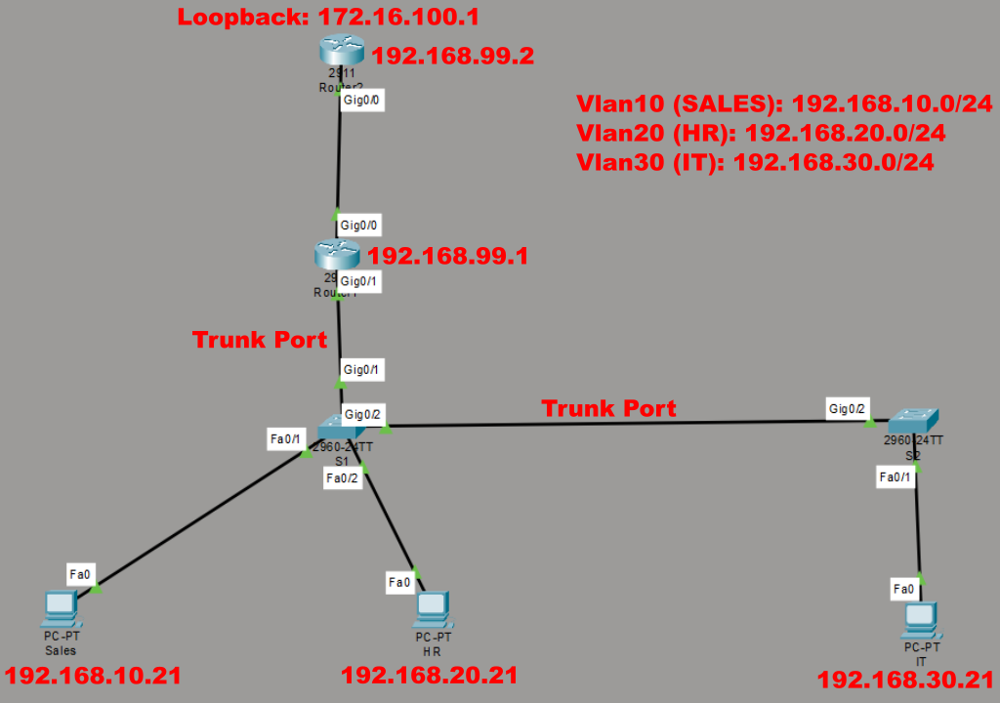
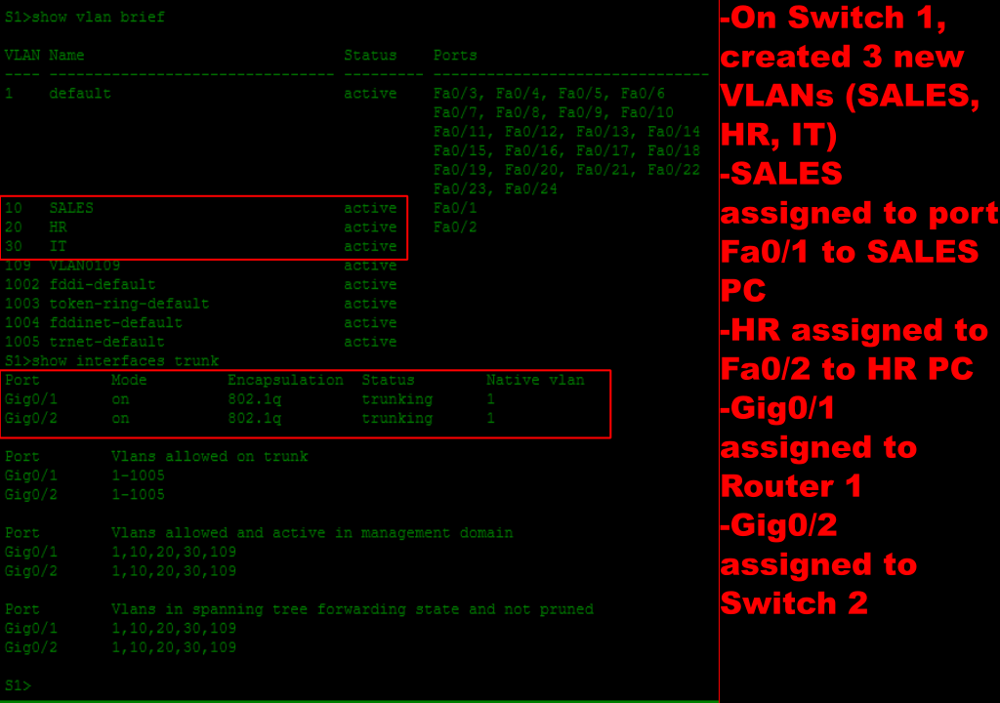
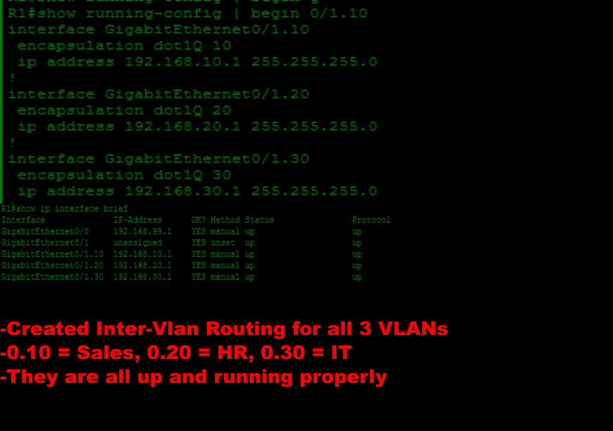
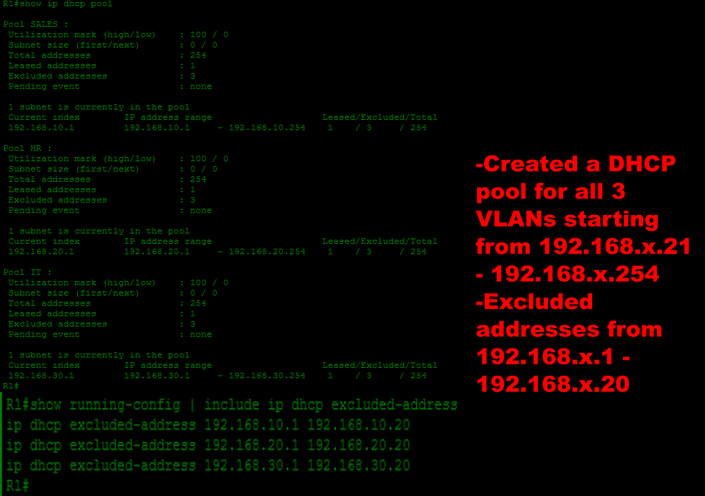
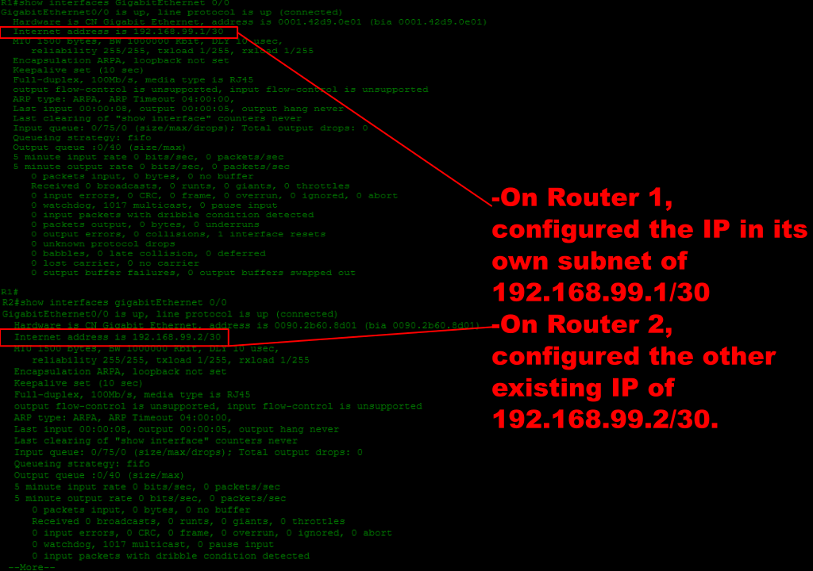
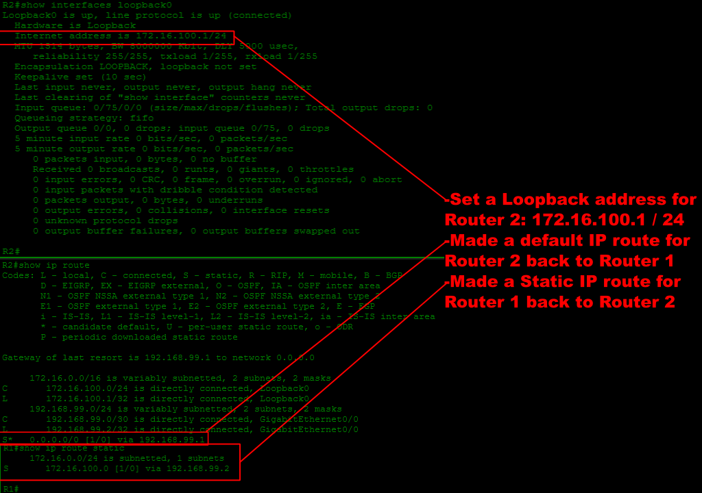
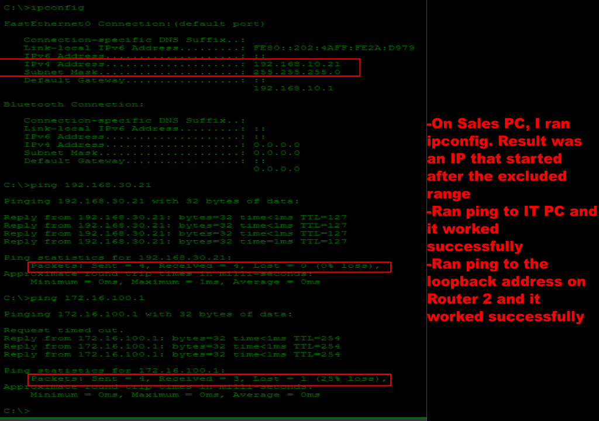

# Cisco Small Business Network

## Overview
This project demonstrates the deployment of a small business network in Cisco Packet Tracer. The lab simulates a multi-department environment using VLANs, Router-on-a-Stick inter-VLAN routing, DHCP, static routing, and a simulated upstream router.

## Goal
Goal of this lab was to build a functional enterprise-style network while learning how switches, routers, VLANs, and routing protocols work together to provide communication between multiple network segments.

## Network Topology
- 2 Cisco Routers
- 2 Cisco Switches
- 3 Client PCs
- Three departmental VLANs
- One simulated upstream router
- One loopback interface representing a remote network

## Technologies Used
- Cisco Packet Tracer
- Cisco IOS CLI
- VLANs
- IEEE 802.1Q Trunking
- Router-on-a-Stick
- Inter-VLAN Routing
- DHCP
- Static Routing
- Default Routing
- Loopback Interfaces
- IPv4 Addressing

## IP Addressing
Network                  Gateway
```
VLAN 10 (Sales)          192.168.10.1/24
VLAN 20 (HR)             192.168.20.1/24
VLAN 30 (IT)             192.168.30.1/24
Router Link              192.168.99.0/34
Remote Network           172.16.100.0/24
```

## Steps Performed
1. Built the Physical Topology
- Added two Cisco Routers
- Added two Cisco Switches
- Connected three client PCs
- Connected both switches together using a trunk link
- Connected the main router to the primary switch
- Connected the main router to a second router using a point-to-point network
2. Created VLANs
- VLAN 10 - Sales
- VLAN 20 - HR
- VLAN 30 - IT
Assigned access ports to the appropiate VLAN for each workstation. Verified configuration using:
show vlan brief
3. Configured Trunk Links
- Switch-to-Switch connection
- Switch-to-Router connection
Verified trunk connection using: show interfaces trunk
4. Configured Router-on-a-Stick
Configured subinterfaces on Router (R1):
- G0/1.10
- G0/1.20
- G0/1.30
Each subinterface was configured with IEEE 802.1Q encapsulation and Default gateway IP address for its VLAN.
Verifed configuration using: show ip interface brief
5. Configured DHCP
Configured Router (R1) as the DHCP server.
- Sales
- HR
- IT
Configured each with a network address, default gateway, DNS server, and excluded gateway addresses. Verified successful leases by using: show ip dhcp binding
6. Configured Static Routing
Connected R1 and R2 using a /30 network.
- Configured a static route on R1 directing traffic destined for the remote network to Router (R2).
- IP route 172.16.100.0 255.255.255.0 192.168.99.2
7. Configured a Loopback Interface
- Created a Loopback0 interface on Router 2 (R2)
- Assigned: 172.16.100.1/24
- Simulated a remote destination network and provided a target for routing verification
8. Configured a Default Route
- Configured a default route on Router 2 (R2) pointing back toward Router (R1)
- IP route: 0.0.0.0 0.0.0.0 192.168.99.1
- Allowed R2 to forward traffic destined for unknown networks back toward the enterprise network
9. Verified Connectivity
- Obtaining IP addresses through DHCP
- Pinging default gateways
- Testing communication between VLANs
- Pinging the remote loopback interface
## Screenshots
Network Layout

---
VLAN Configuration and Trunking

---
Inter-VLAN Routing

---
DHCP Configuration

---
Router Configuration

---
Default Static and Default Routes

---
Verifying Results


