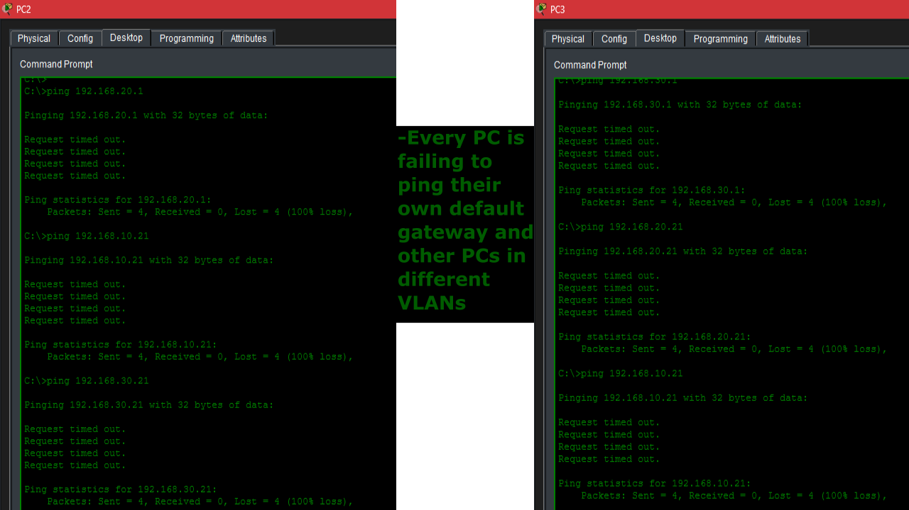
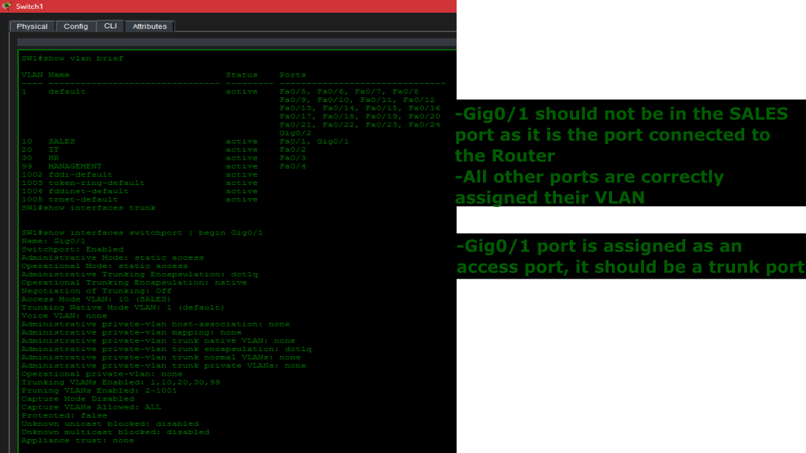
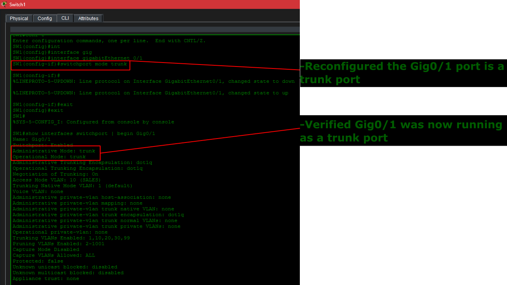
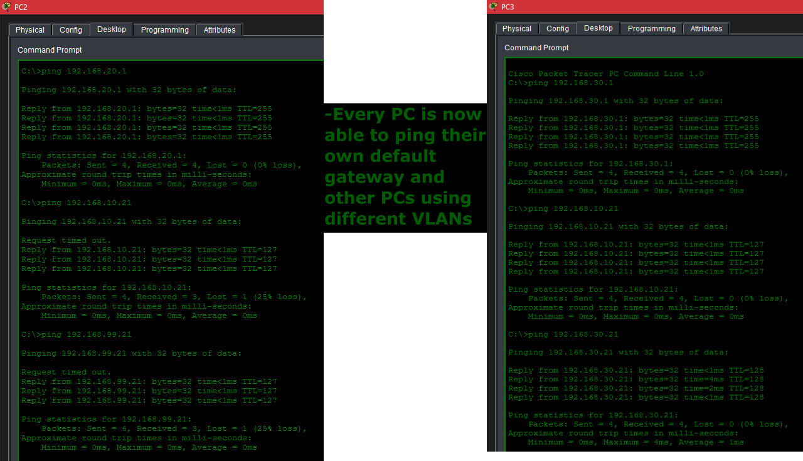

# Trunk Link Misconfiguration

## Problem

Users across multiple departments report that they cannot communicate with devices outside of their own VLAN. Clients are unable to reach their default gateways, obtain DHCP leases, or access resources located on other VLANs.

## Symptoms

- Devices cannot communicate between VLANs.
- Clients cannot reach their default gateway.
- DHCP requests fail.
- Pings to router subinterfaces fail.
- Inter-VLAN routing is unavailable.
- The trunk link is no longer forwarding tagged VLAN traffic.



## Investigation

1. Verified that client devices had correct physical connection.
2. Confirmed PCs were assigned to the correct VLANs.
3. Checked switch VLAN membership using show vlan brief.
4. Examined the switch uplink configuration.
5. Verified trunk status using show interfaces trunk.
6. Determined that the uplink had been configured as an access port instead of a trunk.



## Commands used

Clients
```
ipconfig
ping <default-gateway>
ping <clients>
```
Switch
```
show vlan brief
show interfaces trunk
show interfaces switchport
show running-config
```
Router
```
show ip interface brief
show ip route
```

## Root Cause

The switch uplink connecting the Layer 2 switch to the router was mistakenly configured as an access port. Since Router-on-a-Stick requires an IEEE 802.1Q trunk to transport traffic for multiple VLANs, the router only recieved untagged traffic, preventing communication to the remaining VLANs.

## Resolution

The switch uplink was reconfigured as a trunk.
```
interface GigabitEthernet 0/1
switchport mode trunk
no shutdown
```



## Verification

After restoring the trunk configuration:
- show interfaces trunk confirmed the interface was operating as a trunk.
- All VLANs were successfully forwarding traffic.
- Clients regained connectivity to their default gateways.
- Inter-VLAN communication was restored.
- DHCP address assign functioned correctly.
- End-to-end connectivity between VLANs was successfully verified.



