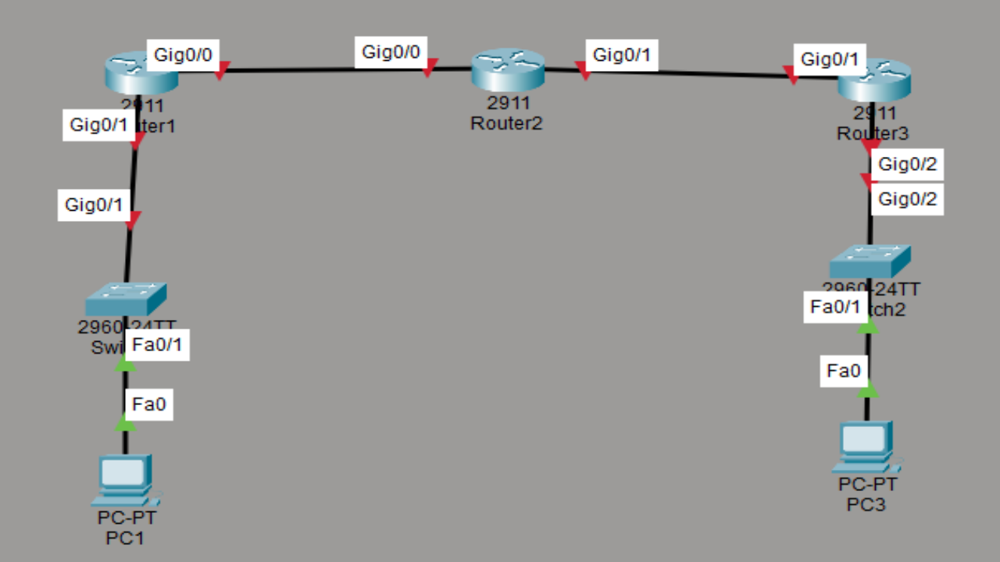
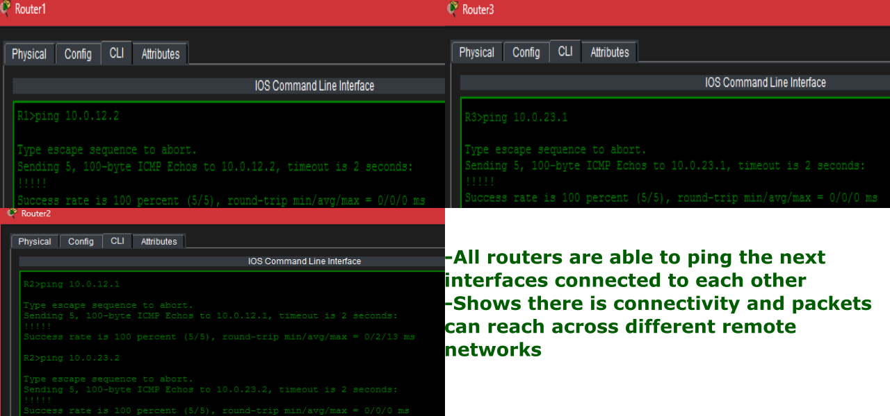
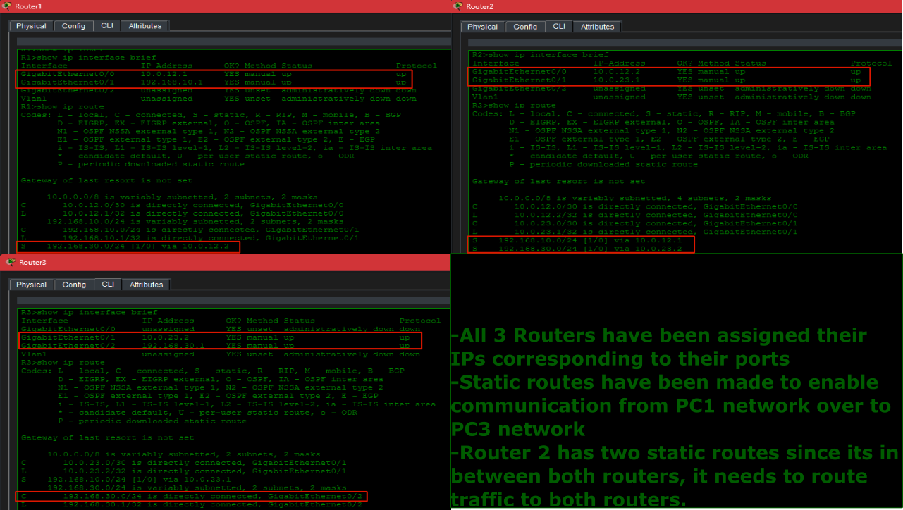
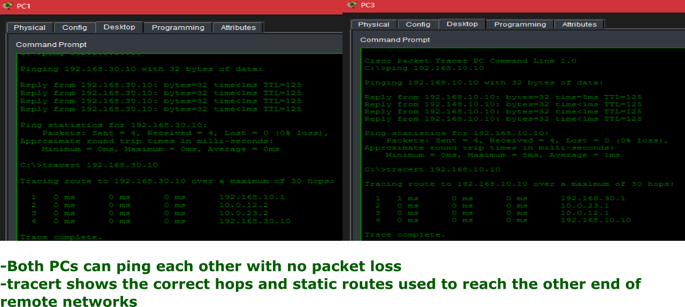

# Static Routing

## Overview

This Cisco Packet Tracer Lab demonstrates how to configure static routes between multiple routers to enable communication between seperate LANs. The lab simulates a small enterprise network where three routers connect two remote office networks using manually configured routing.

## Network Topology
- 3 Cisco Routers
- 2 Cisco Switches
- 3 PCs



## IP Addressing

```
Device    Interface   IP Address
---
PC1        NIC        192.168.10.10/24
PC2        NIC        192.168.30.10/24
R1         G0/1       192.168.10.1/24
R1         G0/0       10.0.12.1/30
R2         G0/0       10.0.12.2/30
R2         G0/1       10.0.23.1/30 
R3         G0/1       10.0.23.2/30
R3         G0/2       192.168.30.1/24
```

## Steps Performed

1. Configured Router Interfaces by assigning IPv4 addresses and using 'no shutdown' command.
2. Configured Static Routes on each router so that every router knew how to reach remote networks.
3. Configured PC networking by assinging: IP address, Subnet mask, Default Gateway.
4. Verified Connectivity by using the following commands:
- Pinging between PCs
- Pinging router interfaces
- Performing end-to-end connectivity tests



5. Verified Routing Tables by using the following commands:
```
show ip route
show ip interface brief
show running-config
```


## Verification

Successful verification included:
- PC1 successfully pinged PC2.
- PC2 successfully pinged PC1.
- Routers successfully reached remote networks.
- Routing tables displayed the expected static routes.
- No packet loss during end-to-end testing.


