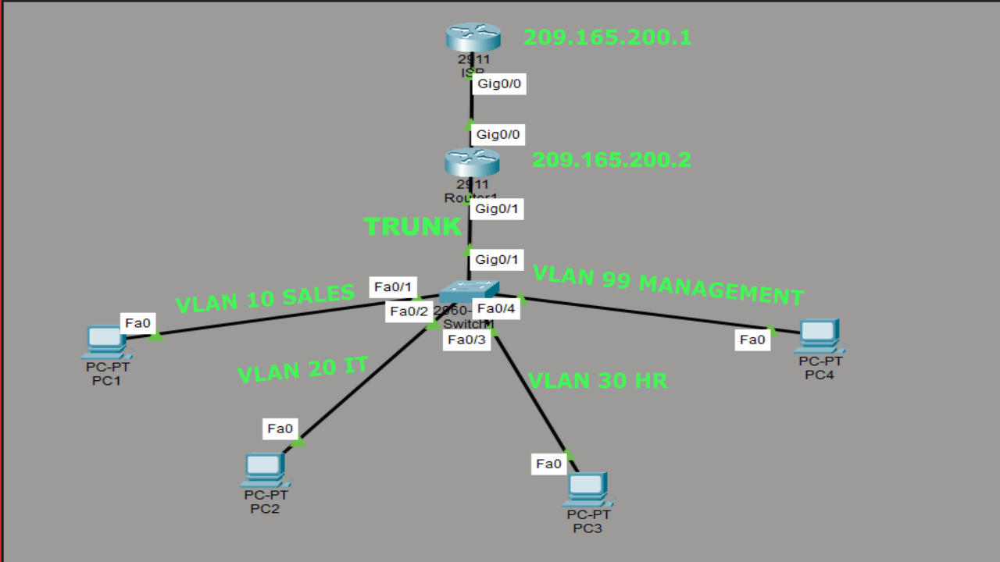

# Router-on-a-Stick

## Overview

This project demonstrates the deployment of Router-on-a-Stick configuration in Cisco Packet Tracer. The lab simulates a small multi-department environemnt using VLANs, Inter-VLAN Routing, DHCP, Router-on-a-Stick, and simulated ISP router.

## Network Topology
- 2 Cisco Routers
- 1 Cisco Switch
- 4 Client PCs
- Four departmental VLANs


## IP Addressing

```
Device        Interface        IP Address            Subnet Mask            Purpose
--- 
ISP           G0/0             209.165.200.1         255.255.255.252        WAN Link
R1            G0/0             209.165.200.2         255.255.255.252        WAN Link to ISP
R1            G0/1.10          192.168.10.1          255.255.255.0          VLAN 10 Gateway
R1            G0/1.20          192.168.20.1          255.255.255.0          VLAN 20 Gateway
R1            G0/1.30          192.168.30.1          255.255.255.0          VLAN 30 Gateway
R1            G0/1.99          192.168.99.1          255.255.255.0          VLAN 99 Gateway
PC1           DHCP             192.168.10.21         255.255.255.0          SALES
PC2           DHCP             192.168.20.21         255.255.255.0          IT
PC3           DHCP             192.168.30.21         255.255.255.0          HR
PC4           DHCP             192.168.99.21         255.255.255.0          Management
```
## Steps Performed

1. Designed an enterprise branch office network using a Cisco Router, Layer 2 switch, ISP router, and four client PCs.
2. Created four VLANs to logically seperate departments:
- VLAN 10 - SALES
- VLAN 20 -IT
- VLAN 30 - HR
- VLAN 99 - MANAGEMENT
3. Assigned switch access ports to their appropiate VLANs for each department
4. Configured the uplink between the switch and router as an IEEE 802.1Q trunk to carry traffic for multiple VLANs
5. COnfigured Router-on-a-Stick by creating router subinterfaces for each VLAN and assigning gateway IP addresses.
6. Enabled 802.1Q encapsulation on each router subinterface to provide inter-VLAN routing
7. Configured DHCP pools on the router for each VLAN:
- Network Address
- Default Gateway
- DNS Server
- Excluded gateway and reserved IP addresses
8. Configured the switch management interface using VLAN 99 and assigned a management IP address
9. Connected the router to a simulated ISP router using a point-to-point WAN network
10. Configured the default route on the branch router to forward unknown traffic to the ISP router
11. Configured static routes on the ISP router to provide return paths to each internal VLAN
12. Verified DHCP lease assignment on all client devices
13. Verified trunk operation using Cisco IOS verification commands
14. Tested inter-VLAN communication by successfully pinging devices across different VLANs
15. Verified end-t0-end routing by confirming connectivity between the branch network and the simulated ISP router
16. Used Cisco IOS verification commands:
```
show vlan brief
show interfaces trunk
show ip interface brief
show ip route
show ip dhcp binding
show ip dhcp pool
show running-conifg
```

