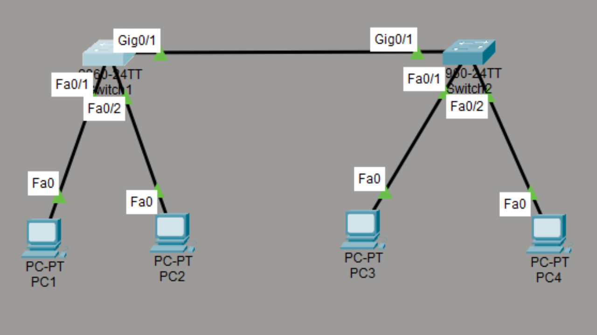
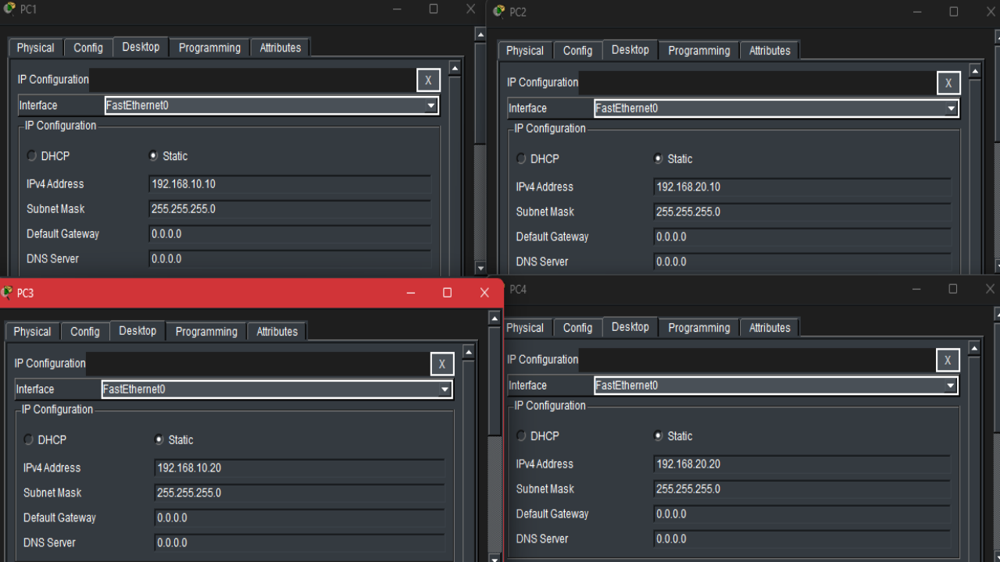
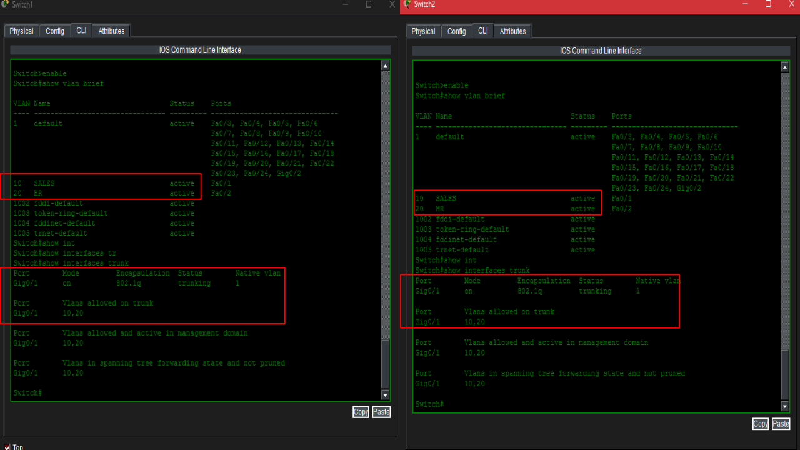
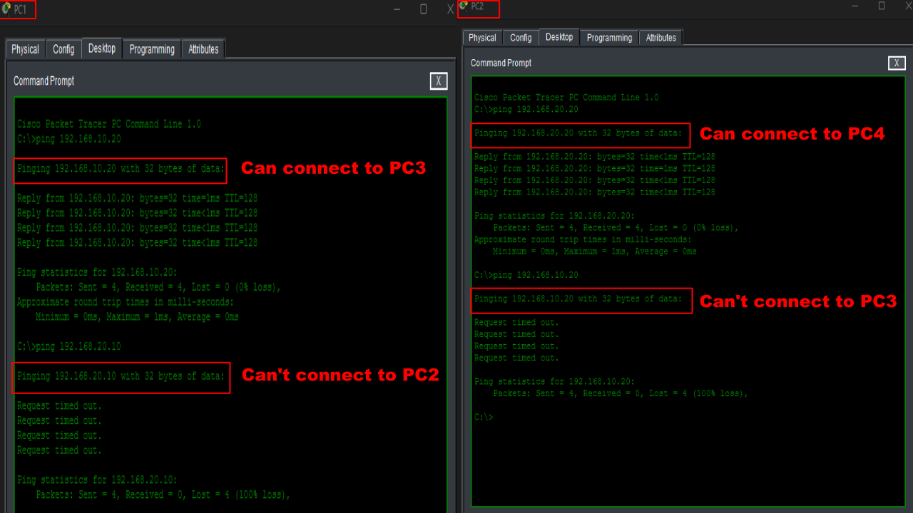
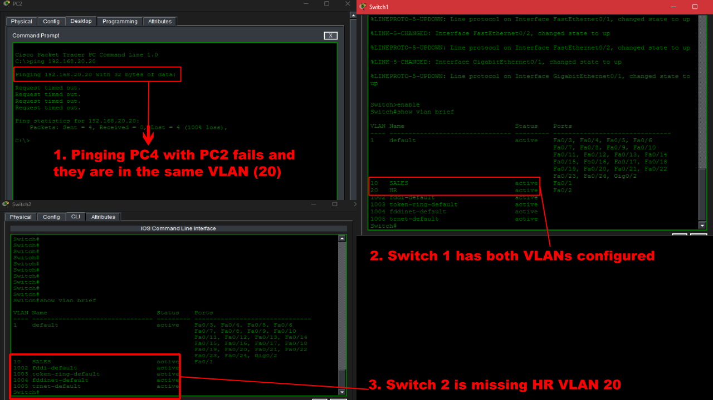
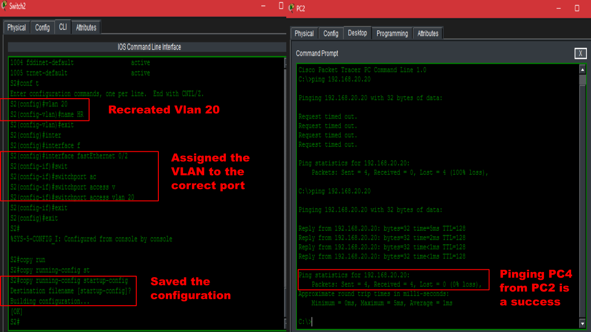
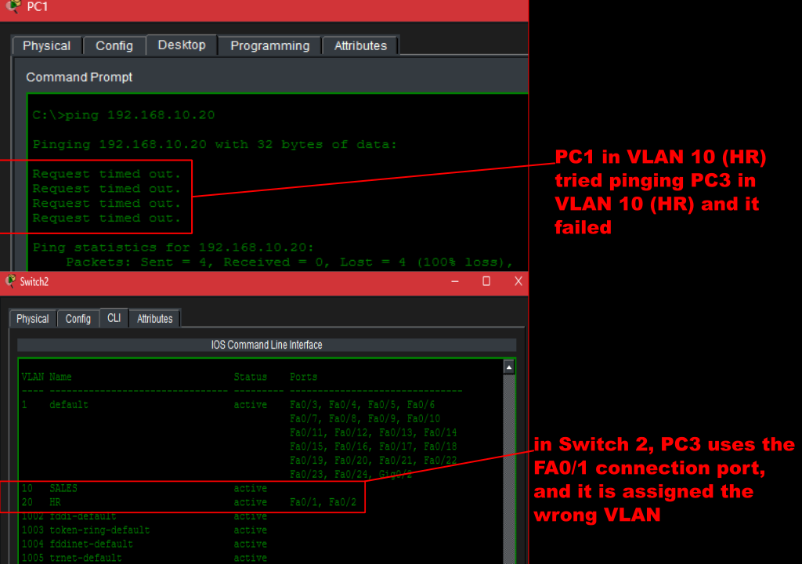
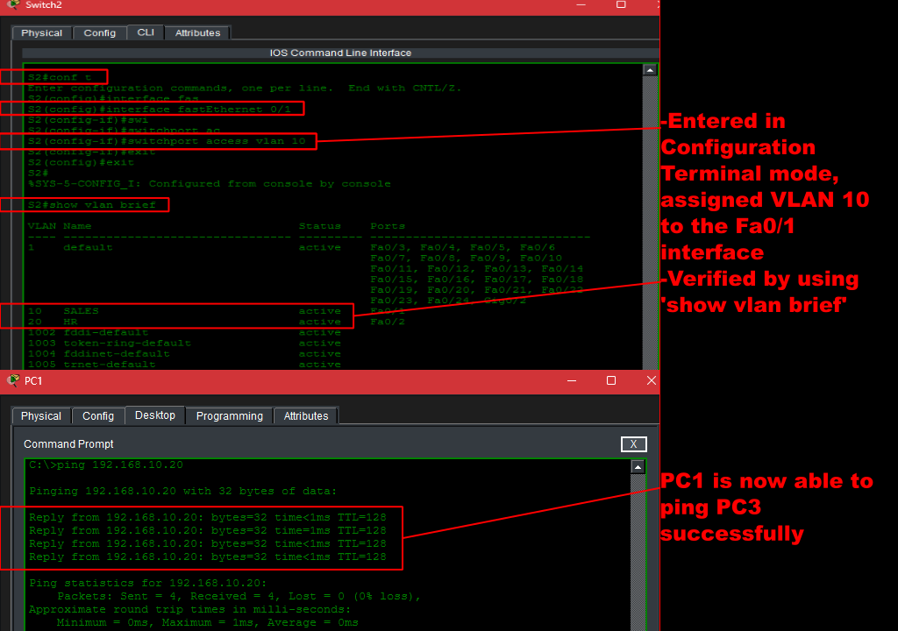
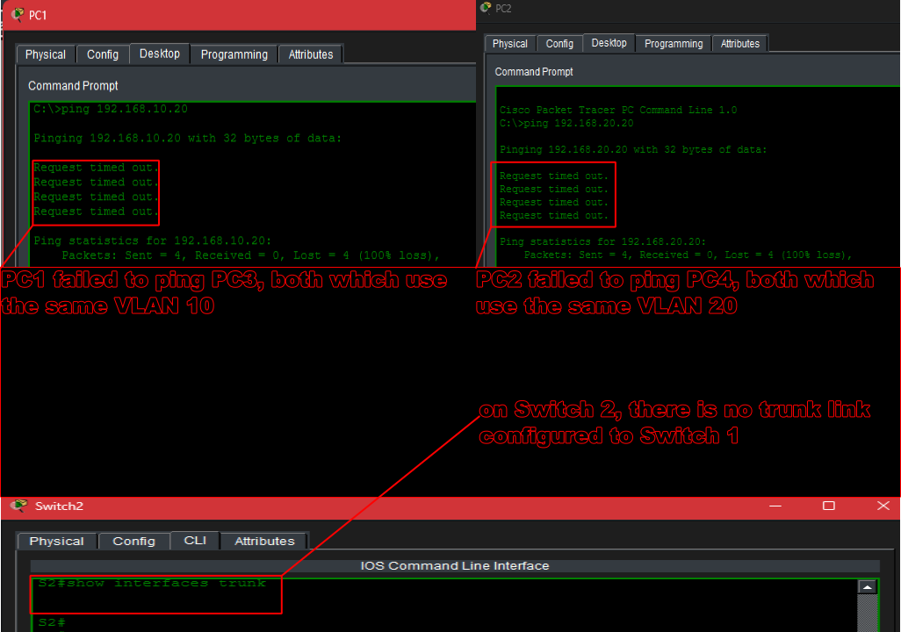
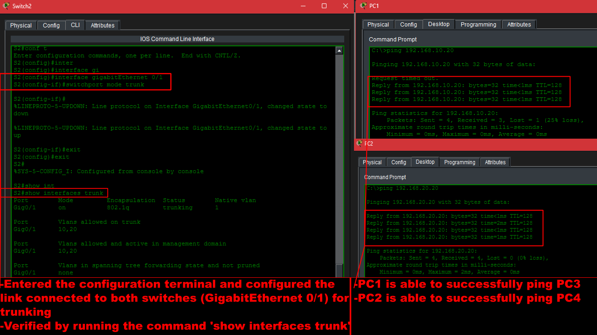

# VLANs and Trunking

## Overview
This Cisco Packet Tracer lab demonstrates how Virtual Local Area Networks (VLANs) logically segment a network and how trunk links allow multiple VLANs to communicate between switches. The lab demonstrates a small business network with two switches connected by an IEEE 802.1Q trunk. 


## Objectives
- Create and configure VLANs on Cisco switches
- Assign switch access ports to the appropiate VLANs
- COnfigure an IEEE 802.1Q trunk between two switches
- Verify vLAN membership and trunk operation
- Test connectivity between hosts
- Demonstrate Layer 2 network segmentation
- Practice troubleshooting common VLAN and trunking problems


## Topology
- 2 Cisco 2960 switches
- 4 PCs
- 1 Trunk Link


## VLAN Assignment
```
Device    VLAN               IP Address
PC1       VLAN 10 (SALES)    192.168.10.10
PC2       VLAN 20 (HR)       192.168.20.10
PC3       VLAN 10 (SALES)    192.168.10.20
PC4       VLAN 20 (HR)       192.168.20.20
```


## Configuration Steps
1. Built the Network Topology.
- Added two Cisco 2960 Switches
- Connected four PCs
- Connected the switches using a Gigabit Ethernet trunk link.


2. Created VLANs
- VLAN 10 = SALES
- VLAN 20 = HR
3. Assigned Access Ports
- Assigned each PC's switch port to its appropiate VLAN.
4. Configured the trunk
- Configured the Gigabit Ethernet interfaces between the switches as trunk ports using IEEE 802.1Q.
5. Assigned IP Addresses
- Configured static IPv4 addresses on each PC within its corresponding VLAN subnet.


6. Verified Configuration
- Used the following commands:
```
show vlan brief
show interfaces trunk
```

7. Tested Connectivity
- Successful:
  - PC1 <-> PC3
  - PC2 <-> PC4
- Unsuccessful (Expected):
  - PC1 <-> PC2
  - PC3 <-> PC4

These failed because inter-VLAN routing was not configured, demonstrating that VLANs isolate Layer 2 broadcast domains.


---
## Troubleshooting - Missing VLAN


---
## Troubleshooting - Incorrect Access VLAN


---
## Troubleshooting- Trunk Removed


